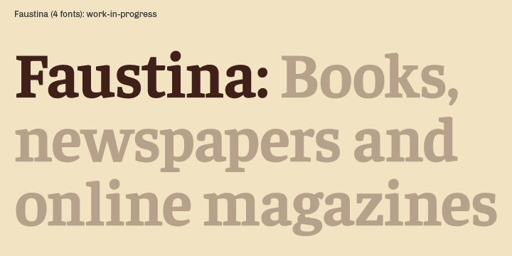

# Faustina family

**Omnibus-Type**  
*SIL Open Font License, 1.1*

Faustina typeface is part of the new Omnibus-Type Press Series. Designed in Twelve styles (light, light italic, regular, italic, medium, medium Italic, semibold, semibold italic, bold, bold italic, extrabold, extrabold italic) for print and online books, newspapers and magazines.

#### Faustina Family contains:

* Light/Light Italic
* Regular/Italic
* Medium/Medium Italic
* SemiBold/SemiBold Italic
* Bold/Bold Italic
* ExtraBold/ExtraBold Italic

To contribute to the project contact [Omnibus-Type](http://omnibus-type.com/)

### Designers

* Alfonso García

## Building

Fonts are built automatically by GitHub Actions - take a look in the "Actions" tab for the latest build.

If you particularly want to build fonts manually on your own computer, you will need to install the [`yq` utility](https://github.com/mikefarah/yq). On OS X with Homebrew, type `brew install yq`; on Linux, try `snap install yq`; if all else fails, try the instructions on the linked page.

Then:

* `make build` will produce font files.
* `make test` will run [FontBakery](https://github.com/googlefonts/fontbakery)'s quality assurance tests.
* `make proof` will generate HTML proof files.

## License

Copyright (c) 2019, Omnibus-Type (www.omnibus-type.com omnibus.type@gmail.com)

This Font Software is licensed under the SIL Open Font License, Version 1.1.
This license is copied below, and is also available with a FAQ at
http://scripts.sil.org/OFL

## Repository Layout

This font repository structure is inspired by [Unified Font Repository v0.3](https://github.com/unified-font-repository/Unified-Font-Repository), modified for the Google Fonts workflow.

======
## FONTLOG for the Faustina fonts

This file provides detailed information on the Faustina font software.  
This information should be distributed along with the Faustina fonts and any derivative works.

### Faustina is a typeface family that supports the following Unicode language range: 

* Basic Latin 					U+0020-U+007E
* Latin-1 Supplement 			U+00A0-U+00FF
* Latin Extended-A 				U+0100-U+017F
* Latin Extended Additional*	U+1E00-U+1EFF *(111/256)

**Character map to support MS Codepages:**
* 1252 Latin-1
* 1250 Latin-2 (Easter Europe)
* 1254 Turkish
* 1257 Windows Baltic
* 1258 Vietnamese
* Mac Roman

*To contribute to the project contact Omnibus-Type at omnibus.type@gmail.com*

**2019 November 21 (v1.007) Add Light/Light Italic and ExtraBold/ExtraBold Italic**

- New masters: light, Light Italic, ExtraBold, ExtraBold italic
- Updated to GF Latin Plus set
- Supports 218 Latin languages used in 212 countries 

**2016 July 28 (v1.006) compatible masters - Nicolás Silva Schwarzenberg**

- Sources with compatible paths
- New Medium weight
- New Semibold weight

**2016 June 4 (v1.005) Initial Commit - Nicolás Silva Schwarzenberg**

- Initial Commit

### Acknowledgements

If you make modifications be sure to add your name (N), email (E), web-address
(if you have one) (W) and description (D). This list is in alphabetical order.

**N:** **Yorlmar Campos**  
**E:** omnibus.type@gmail.com  
**W:** http://www.omnibus-type.com  
**D:** Typeface development 

**N:** **Alfonso García**  
**E:** omnibus.type@gmail.com  
**W:** http://www.omnibus-type.com  
**D:** Designer

**N:** **Martín Sesto**  
**E:** omnibus.type@gmail.com  
**W:** http://www.omnibus-type.com  
**D:** Typeface development

**N:** **Nicolás Silva Schwarzenberg**  
**E:** nsilva.design@gmail.com  
**W:** http://www.omnibus-type.com  
**D:** Typeface development